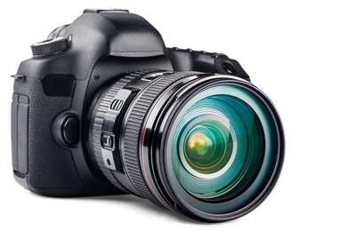

+++ 
noatcards = True 
isdraft = False 
+++

# 1000 commons english vocabulary

## Camera

Camera a device for taking photographs or making films or television programmes:

Example:

I forgot to take my camera with me to Portugal, so I couldn't take any photos. Television camera crews broadcast the event all round the world. It was said of Marilyn Monroe that the camera loved her (= that she looked very attractive on film and in photographs).

----

----

UK /ˈkæm.rə/ US /ˈkæm.rə/

